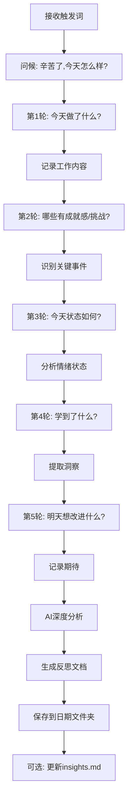

# ClaudeCode_Secretary 技术规范

本文档详细说明三个agent的完整技术实现细节。

---

## Agent 1: 新闻张 (News Zhang)

### 基本信息
- **Agent ID**: `news-zhang`
- **触发词**: "早上好"
- **角色定位**: 晨间新闻助理，提供AI/金融/股市资讯

### 技术实现细节

#### 1. 触发机制
```yaml
触发方式: Claude Code Slash Command
命令文件: .claude/commands/早上好.md
触发条件: 用户输入 "早上好" 或 /早上好
```

#### 2. 新闻搜索策略

**AI领域新闻**:
```
搜索关键词:
- "大模型" OR "LLM" OR "GPT" OR "Claude" OR "ChatGPT"
- "人工智能" AND ("应用" OR "突破" OR "发布")
- "AI工具" OR "AI Agent"

时间范围: 最近24小时
数量限制: 3-5条
来源优先级:
1. 机器之心、量子位、新智元（中文）
2. TechCrunch, The Verge, VentureBeat（英文）
3. Twitter/X 技术KOL动态
```

**金融市场新闻**:
```
搜索关键词:
- "央行" OR "货币政策" OR "利率"
- "美联储" OR "Fed" OR "加息" OR "降息"
- "人民币汇率" OR "美元指数"
- "黄金" OR "原油" OR "大宗商品"

时间范围: 最近24小时
数量限制: 3-5条
来源优先级:
1. 财联社、第一财经、华尔街见闻
2. Bloomberg, Reuters, CNBC
3. 各国央行官网公告
```

**股市动态**:
```
搜索关键词:
- "A股" OR "上证指数" OR "深证成指" OR "创业板"
- "美股" OR "纳斯达克" OR "标普500" OR "道琼斯"
- "港股" OR "恒生指数"
- 热门板块: "科技股" "新能源" "半导体" "医药"

时间范围: 最近24小时
数量限制: 3-5条
来源优先级:
1. 东方财富、同花顺、雪球
2. MarketWatch, Yahoo Finance
3. 券商研报标题
```

#### 3. 新闻处理流程

```mermaid
graph TD
    A[接收"早上好"触发] --> B[并行搜索三类新闻]
    B --> C1[AI新闻搜索]
    B --> C2[金融新闻搜索]
    B --> C3[股市新闻搜索]
    C1 --> D[去重和过滤]
    C2 --> D
    C3 --> D
    D --> E[内容摘要生成]
    E --> F[生成Markdown文档]
    F --> G[创建日期文件夹]
    G --> H[保存文件]
    H --> I[发送飞书通知]
```

#### 4. 新闻过滤规则

**去重逻辑**:
- 标题相似度 > 80% → 保留最新的一条
- 同一事件不同报道 → 合并摘要，标注多个来源

**质量过滤**:
- 排除: 广告、软文、低质量自媒体
- 优先: 官方来源、权威媒体、数据报告
- 必须包含: 时间、来源、有效链接

**语言处理**:
- 英文新闻 → 自动翻译关键信息为中文
- 保留原文链接供详细阅读

#### 5. 输出格式规范

```markdown
# YYYY-MM-DD 今日新闻简报

> 🕐 生成时间: HH:MM
> 📰 新闻总数: X条

---

## 🤖 AI领域

### [标题1]
**来源**: 来源名称 | **时间**: HH:MM
**摘要**: 100字以内的核心内容总结
**关键词**: #标签1 #标签2
**链接**: [阅读原文](URL)

---

### [标题2]
...

---

## 💰 金融市场

### [标题]
**来源**: | **时间**:
**摘要**:
**影响分析**: 对市场的潜在影响（30字以内）
**链接**: [阅读原文](URL)

---

## 📈 股市动态

### A股市场
- **上证指数**: XXXX点 (±X.XX%)
- **深证成指**: XXXX点 (±X.XX%)
- **热点板块**: XXX板块领涨/领跌

### 全球市场
- **美股**: ...
- **港股**: ...

### 重点新闻
[标题] 摘要 | 来源 | [链接]

---

## 🎯 今日小结

[AI生成的综合分析，200-300字]
- 今日核心主题
- 市场情绪判断
- 值得关注的趋势
```

#### 6. 飞书通知格式

**消息类型**: Interactive Card (富文本卡片)

**卡片结构**:
```json
{
  "msg_type": "interactive",
  "card": {
    "header": {
      "title": {
        "content": "📰 今日新闻简报",
        "tag": "plain_text"
      },
      "template": "blue"
    },
    "elements": [
      {
        "tag": "div",
        "text": {
          "content": "🤖 AI领域: X条 | 💰 金融: X条 | 📈 股市: X条",
          "tag": "plain_text"
        }
      },
      {
        "tag": "hr"
      },
      {
        "tag": "div",
        "text": {
          "content": "[新闻精选摘要，不超过200字]",
          "tag": "lark_md"
        }
      },
      {
        "tag": "action",
        "actions": [
          {
            "tag": "button",
            "text": {
              "content": "查看完整报告",
              "tag": "plain_text"
            },
            "url": "feishu://doc/[文档链接]",
            "type": "default"
          }
        ]
      }
    ]
  }
}
```

#### 7. 错误处理

**网络错误**:
- 搜索超时(>30s) → 使用缓存的热门新闻
- API限流 → 降级使用RSS源

**内容缺失**:
- 某类新闻 < 3条 → 标注"今日该领域较为平静"
- 全部搜索失败 → 生成最小化报告 + 错误日志

**生成失败**:
- 保存到 `error_logs/YYYY-MM-DD_news_error.log`
- 发送简化版飞书通知说明情况

#### 8. 配置文件

**config/news_agent_config.json**:
```json
{
  "agent_name": "新闻张",
  "trigger_phrase": ["早上好", "morning"],
  "search_config": {
    "ai_news": {
      "keywords": ["大模型", "LLM", "ChatGPT", "AI Agent"],
      "max_results": 5,
      "time_range": "24h",
      "sources": ["机器之心", "量子位", "TechCrunch"]
    },
    "finance_news": {
      "keywords": ["央行", "货币政策", "美联储", "汇率"],
      "max_results": 5,
      "time_range": "24h",
      "sources": ["财联社", "Bloomberg", "Reuters"]
    },
    "stock_news": {
      "keywords": ["A股", "上证指数", "纳斯达克", "恒生指数"],
      "max_results": 5,
      "time_range": "24h",
      "sources": ["东方财富", "Yahoo Finance"]
    }
  },
  "output_config": {
    "folder_pattern": "daily_records/{YYYY-MM-DD}/",
    "filename": "今日新闻.md",
    "max_summary_length": 100,
    "language": "zh-CN"
  },
  "feishu_config": {
    "webhook_url": "${FEISHU_WEBHOOK_URL}",
    "notify_enabled": true,
    "card_color": "blue"
  },
  "cache_config": {
    "enable_cache": true,
    "cache_ttl": 3600
  }
}
```

---

## Agent 2: 教练张 (Coach Zhang)

### 基本信息
- **Agent ID**: `coach-zhang`
- **触发词**: "自律"
- **角色定位**: 健康教练，体重管理和生活方式建议

### 技术实现细节

#### 1. 触发机制
```yaml
触发方式: Claude Code Slash Command
命令文件: .claude/commands/自律.md
触发条件: 用户输入 "自律" 或 /自律
```

#### 2. 对话流程设计

```mermaid
graph TD
    A[接收"自律"触发] --> B[问候: 今天多少斤?]
    B --> C[获取体重输入]
    C --> D[读取 about_me.md]
    D --> E[读取 health_history.md]
    E --> F[计算体重变化趋势]
    F --> G{体重变化情况}
    G -->|下降| H[生成鼓励+维持建议]
    G -->|上升| I[生成激励+加强建议]
    G -->|平稳| J[生成坚持+优化建议]
    H --> K[生成运动计划]
    I --> K
    J --> K
    K --> L[生成饮食建议]
    L --> M[保存健康.md]
    M --> N[更新 about_me.md]
    N --> O[更新 health_history.md]
```

#### 3. 数据结构设计

**context/about_me.md** (用户档案):
```markdown
# 关于我

## 基本信息
- 姓名: 张俊
- 年龄: [年龄]
- 身高: [身高] cm
- 性别: 男

## 健康目标
- 目标体重: XX.X kg
- 目标达成日期: YYYY-MM-DD
- 周减重目标: 0.5-1 kg/周

## 运动偏好
- 喜欢的运动: 跑步、健身、游泳
- 不喜欢的运动: [列表]
- 运动时间偏好: 早上/晚上
- 可用运动时长: XX分钟/天

## 饮食偏好
- 口味偏好: 清淡/重口味/适中
- 饮食限制: 无/过敏/宗教
- 喜欢的菜系: 川菜、粤菜、日料
- 不喜欢的食物: [列表]
- 每日热量目标: XXXX kcal

## 当前状态
- 最新体重: XX.X kg (YYYY-MM-DD)
- BMI: XX.X
- 体重状态: 超重/正常/偏瘦
```

**context/health_history.md** (历史记录):
```markdown
# 健康历史记录

## 体重记录
| 日期 | 体重(kg) | 较前日 | 较周平均 | 备注 |
|------|---------|--------|----------|------|
| 2025-01-19 | XX.X | -0.2 | -0.5 | 坚持运动 |
| 2025-01-18 | XX.X | +0.1 | -0.3 | 外出聚餐 |
| ... | ... | ... | ... | ... |

## 运动记录
| 日期 | 运动类型 | 时长(分钟) | 强度 | 消耗(kcal) |
|------|---------|-----------|------|-----------|
| 2025-01-19 | 跑步 | 30 | 中 | ~300 |
| ... | ... | ... | ... | ... |

## 趋势分析
- 7日平均体重: XX.X kg
- 30日平均体重: XX.X kg
- 距离目标: XX.X kg
- 预计达成日期: YYYY-MM-DD
```

#### 4. 算法设计

**体重变化分析**:
```python
def analyze_weight_trend(current_weight, history):
    """
    分析体重变化趋势
    """
    # 计算日变化
    daily_change = current_weight - history[-1]['weight']

    # 计算7日平均
    week_avg = sum([d['weight'] for d in history[-7:]]) / 7
    week_change = current_weight - week_avg

    # 计算变化率
    change_rate = (daily_change / history[-1]['weight']) * 100

    # 判断趋势
    if week_change < -0.5:
        trend = "良好下降"
        advice_type = "维持型"
    elif week_change < -0.2:
        trend = "稳定下降"
        advice_type = "维持型"
    elif abs(week_change) <= 0.2:
        trend = "基本持平"
        advice_type = "加强型"
    elif week_change < 0.5:
        trend = "小幅上升"
        advice_type = "强化型"
    else:
        trend = "明显上升"
        advice_type = "强化型"

    return {
        'daily_change': daily_change,
        'week_change': week_change,
        'trend': trend,
        'advice_type': advice_type
    }
```

**运动建议生成**:
```python
def generate_exercise_plan(weight_trend, user_profile):
    """
    基于体重趋势和用户偏好生成运动计划
    """
    advice_type = weight_trend['advice_type']
    preferences = user_profile['exercise_preferences']

    if advice_type == "维持型":
        intensity = "中等"
        duration = 30  # 分钟
        exercises = preferences['favorite']  # 用户喜欢的运动
    elif advice_type == "加强型":
        intensity = "中高"
        duration = 40
        exercises = mix_exercises(preferences)  # 混合运动
    elif advice_type == "强化型":
        intensity = "高"
        duration = 50
        exercises = high_intensity_exercises(preferences)

    return {
        'type': exercises,
        'duration': duration,
        'intensity': intensity,
        'calories': estimate_calories(exercises, duration, intensity)
    }
```

**饮食建议算法**:
```python
def generate_meal_plan(weight_trend, user_profile):
    """
    生成个性化餐饮建议
    """
    daily_calorie_target = calculate_calorie_target(
        current_weight=user_profile['current_weight'],
        target_weight=user_profile['target_weight'],
        activity_level=user_profile['activity_level']
    )

    # 三餐热量分配: 早30% 午40% 晚30%
    breakfast_cal = daily_calorie_target * 0.3
    lunch_cal = daily_calorie_target * 0.4
    dinner_cal = daily_calorie_target * 0.3

    # 根据用户口味偏好和热量限制推荐餐厅
    meals = {
        'breakfast': recommend_meal(
            calorie_limit=breakfast_cal,
            meal_type='breakfast',
            preferences=user_profile['food_preferences']
        ),
        'lunch': recommend_meal(
            calorie_limit=lunch_cal,
            meal_type='lunch',
            preferences=user_profile['food_preferences']
        ),
        'dinner': recommend_meal(
            calorie_limit=dinner_cal,
            meal_type='dinner',
            preferences=user_profile['food_preferences']
        )
    }

    return meals
```

#### 5. 外卖推荐数据库

**restaurants_db.json** (外卖数据库):
```json
{
  "breakfast": [
    {
      "name": "桂满陇",
      "dishes": [
        {
          "name": "皮蛋瘦肉粥",
          "calories": 180,
          "protein": 8,
          "carbs": 30,
          "fat": 3,
          "price": 15
        },
        {
          "name": "素菜包",
          "calories": 120,
          "protein": 4,
          "carbs": 22,
          "fat": 2,
          "price": 8
        }
      ]
    }
  ],
  "lunch": [
    {
      "name": "真功夫",
      "dishes": [
        {
          "name": "蒸鸡腿饭",
          "calories": 520,
          "protein": 35,
          "carbs": 60,
          "fat": 12,
          "tags": ["高蛋白", "低脂"],
          "price": 28
        }
      ]
    }
  ],
  "dinner": [
    {
      "name": "吉野家",
      "dishes": [
        {
          "name": "牛肉饭(小碗)",
          "calories": 450,
          "protein": 20,
          "carbs": 55,
          "fat": 15,
          "price": 22
        }
      ]
    }
  ]
}
```

#### 6. 输出格式规范

```markdown
# YYYY-MM-DD 健康计划

> 💪 教练张为你制定今日健康方案
> ⏰ 生成时间: HH:MM

---

## 📊 今日体重

| 指标 | 数值 | 说明 |
|------|------|------|
| 当前体重 | XX.X kg | |
| 目标体重 | XX.X kg | |
| 日变化 | ±X.X kg | 较昨日 |
| 周变化 | ±X.X kg | 较7日均值 |
| 距离目标 | X.X kg | 约需X周 |

**趋势分析**: [良好下降/稳定下降/基本持平/小幅上升/明显上升]

---

## 🏃 运动建议

### 今日推荐
- **项目**: 跑步 + 力量训练
- **时长**: 40分钟 (跑步30分钟 + 拉伸10分钟)
- **强度**: 中等
- **预计消耗**: ~350 kcal
- **最佳时段**: 18:00-19:00 (根据你的习惯)

### 运动方案
**跑步 (30分钟)**
- 热身: 5分钟慢跑
- 主体: 20分钟中速跑 (配速6:00/km)
- 放松: 5分钟慢跑

**拉伸 (10分钟)**
- 腿部拉伸: 3分钟
- 核心拉伸: 3分钟
- 上肢拉伸: 2分钟
- 放松呼吸: 2分钟

### 运动目标
[根据体重趋势给出的具体理由，例如:]
"本周体重下降趋势良好,今天保持中等强度运动即可。注意不要过度训练导致疲劳。"

---

## 🍽️ 饮食建议

> 今日目标摄入: ~1800 kcal
> 建议配比: 蛋白质30% | 碳水50% | 脂肪20%

### 早餐 (540 kcal)
**推荐方案一: 桂满陇**
- 🥣 皮蛋瘦肉粥 (180 kcal)
- 🥟 素菜包 x2 (240 kcal)
- 🥚 水煮蛋 (70 kcal)
- 🥛 无糖豆浆 (50 kcal)
- 💰 预计: ¥23

**推荐方案二: 自制**
- 燕麦粥 + 香蕉 + 鸡蛋
- 💰 预计: ¥10

---

### 午餐 (720 kcal)
**推荐方案: 真功夫**
- 🍗 蒸鸡腿饭 (520 kcal)
- 🥗 素菜拼盘 (150 kcal)
- 🍵 无糖茶饮 (0 kcal)
- 💰 预计: ¥35

**营养分析**:
- 蛋白质: 40g (充足)
- 碳水: 65g (适中)
- 脂肪: 18g (低脂)
- ✅ 高蛋白、低脂肪,适合减重期

**替代方案**:
如果不想吃鸡腿饭,可以选择"吉野家牛肉饭(小碗)"(450 kcal)

---

### 晚餐 (540 kcal)
**推荐方案: 沙拉轻食**
- 🥗 鸡胸肉沙拉 (350 kcal)
- 🍠 蒸红薯 (150 kcal)
- 💧 气泡水 (0 kcal)
- 💰 预计: ¥30

**建议**:
晚餐尽量清淡,避免高碳水高脂肪。如果运动后很饿,可以增加一份水果。

---

### 加餐 (可选)
**下午茶 (3pm)**
- 🍎 苹果/香蕉 (~100 kcal)
- 或
- 🥜 坚果小包 (~150 kcal)

---

## 💧 饮水提醒
- **目标**: 2000-2500 ml/天
- **建议**: 起床后、三餐前、运动中都要补水
- **时间表**:
  - 07:00 起床 → 300ml 温水
  - 10:00 上午 → 200ml
  - 12:00 午餐前 → 200ml
  - 15:00 下午 → 200ml
  - 18:00 运动中 → 300ml
  - 19:30 晚餐前 → 200ml
  - 21:00 睡前1h → 200ml

---

## 📝 今日寄语

[根据体重趋势生成的个性化激励话语]

**良好趋势示例**:
"💪 干得好!本周体重下降0.8kg,说明你的努力有了回报。继续保持这个节奏,预计3周后可以达到阶段性目标。记住:健康减重是一场马拉松,不是百米冲刺!"

**需要加强示例**:
"🔥 这周体重有小幅波动,不要气馁!体重管理本来就不是一帆风顺的。今天加强一点运动强度,严格控制饮食,相信明天的你会感谢今天的坚持!"

---

## 📈 长期追踪

**本周概览** (YYYY-MM-DD 至 YYYY-MM-DD)
- 周初体重: XX.X kg
- 周末体重: XX.X kg
- 周变化: -X.X kg ✅
- 周运动: X天,共XXX分钟
- 目标完成度: XX%

**月度目标**
- 月初: XX.X kg
- 月末目标: XX.X kg (-2kg)
- 当前进度: X.X kg / 2kg (XX%)
- 预计完成: [能/不能]如期完成

---

_🤖 本计划由教练张基于你的健康数据和历史记录生成_
_如有身体不适或特殊情况,请及时调整计划或咨询医生_
```

#### 7. 数据更新逻辑

**更新 about_me.md**:
```python
def update_about_me(new_weight, date):
    """
    更新用户档案中的最新体重
    """
    # 读取现有档案
    profile = read_markdown('context/about_me.md')

    # 更新"当前状态"部分
    profile['current_status']['latest_weight'] = {
        'weight': new_weight,
        'date': date,
        'bmi': calculate_bmi(new_weight, profile['height'])
    }

    # 保存更新
    write_markdown('context/about_me.md', profile)
```

**更新 health_history.md**:
```python
def update_health_history(weight_data, exercise_data):
    """
    追加新记录到健康历史
    """
    history = read_markdown('context/health_history.md')

    # 追加体重记录
    history['weight_records'].append({
        'date': weight_data['date'],
        'weight': weight_data['weight'],
        'daily_change': weight_data['daily_change'],
        'week_avg_change': weight_data['week_change'],
        'note': weight_data.get('note', '')
    })

    # 追加运动记录
    history['exercise_records'].append({
        'date': exercise_data['date'],
        'type': exercise_data['type'],
        'duration': exercise_data['duration'],
        'intensity': exercise_data['intensity'],
        'calories': exercise_data['calories']
    })

    # 重新计算趋势
    history['trend_analysis'] = recalculate_trends(history)

    # 保存
    write_markdown('context/health_history.md', history)
```

#### 8. 配置文件

**config/coach_agent_config.json**:
```json
{
  "agent_name": "教练张",
  "trigger_phrase": ["自律"],
  "personality": {
    "tone": "鼓励、专业、温暖",
    "style": "私人教练"
  },
  "health_config": {
    "weight_unit": "kg",
    "calorie_unit": "kcal",
    "target_weekly_loss": [0.5, 1.0],
    "min_daily_calories": 1500,
    "max_daily_calories": 2500
  },
  "exercise_config": {
    "intensity_levels": {
      "low": {"duration": 20, "calorie_rate": 5},
      "medium": {"duration": 30, "calorie_rate": 8},
      "high": {"duration": 40, "calorie_rate": 12}
    },
    "exercise_types": [
      {"name": "跑步", "calorie_rate": 10, "difficulty": "medium"},
      {"name": "健身", "calorie_rate": 8, "difficulty": "medium"},
      {"name": "游泳", "calorie_rate": 12, "difficulty": "high"},
      {"name": "瑜伽", "calorie_rate": 4, "difficulty": "low"}
    ]
  },
  "meal_config": {
    "meal_distribution": {
      "breakfast": 0.3,
      "lunch": 0.4,
      "dinner": 0.3
    },
    "restaurants_db_path": "data/restaurants_db.json"
  },
  "output_config": {
    "folder_pattern": "daily_records/{YYYY-MM-DD}/",
    "filename": "健康.md"
  },
  "data_update": {
    "update_about_me": true,
    "update_health_history": true,
    "history_retention_days": 365
  }
}
```

---

## Agent 3: 反思张 (Reflection Zhang)

### 基本信息
- **Agent ID**: `reflection-zhang`
- **触发词**: "今工作结束了"
- **角色定位**: 工作反思引导师,帮助深度思考和自我成长

### 技术实现细节

#### 1. 触发机制
```yaml
触发方式: Claude Code Slash Command
命令文件: .claude/commands/今工作结束了.md
触发条件:
  - "今工作结束了"
  - "今天工作完成了"
  - "下班了"
  - /反思
```

#### 2. 对话流程设计



#### 3. 对话引导词库

**第1轮 - 工作内容探索**:
```json
{
  "round": 1,
  "goal": "了解今天的工作内容",
  "questions": [
    "今天主要做了什么工作呢?",
    "能跟我说说今天忙了些什么吗?",
    "今天的工作内容有哪些?"
  ],
  "follow_up": [
    "听起来很充实!还有其他事情吗?",
    "这个[具体任务]花了多长时间?",
    "除了这些,还有需要提到的吗?"
  ],
  "extraction_targets": [
    "工作任务列表",
    "时间分配",
    "协作对象",
    "完成情况"
  ]
}
```

**第2轮 - 情感体验挖掘**:
```json
{
  "round": 2,
  "goal": "识别情感高点和低点",
  "questions": [
    "这些工作中,哪些让你感到有成就感?",
    "有遇到什么挑战或困难吗?",
    "今天有什么让你特别有感触的时刻?"
  ],
  "follow_up": [
    "为什么[这件事]让你有成就感?",
    "这个挑战是怎么出现的?",
    "你当时是怎么处理的?",
    "结果如何?"
  ],
  "extraction_targets": [
    "成就事件 + 原因",
    "挑战事件 + 应对方式",
    "情绪触发点"
  ]
}
```

**第3轮 - 状态评估**:
```json
{
  "round": 3,
  "goal": "评估整体状态和情绪",
  "questions": [
    "你觉得今天的状态怎么样?",
    "工作时的精力如何?",
    "有什么情绪波动吗?"
  ],
  "follow_up": [
    "是什么让你感到[疲惫/兴奋/焦虑]?",
    "这种感觉持续了多久?",
    "有没有影响到工作效率?"
  ],
  "extraction_targets": [
    "精力水平: 1-10分",
    "主导情绪: [兴奋/平静/焦虑/疲惫/...]",
    "情绪触发因素",
    "压力来源"
  ]
}
```

**第4轮 - 学习提取**:
```json
{
  "round": 4,
  "goal": "提取学习和成长点",
  "questions": [
    "从今天的经历中,你学到了什么?",
    "有什么新的认识或想法吗?",
    "今天有什么值得记住的经验?"
  ],
  "follow_up": [
    "这个认识对以后的工作有什么帮助?",
    "你打算怎么应用这个经验?",
    "还有其他收获吗?"
  ],
  "extraction_targets": [
    "技能提升",
    "认知更新",
    "经验教训",
    "方法论"
  ]
}
```

**第5轮 - 前瞻规划**:
```json
{
  "round": 5,
  "goal": "展望明天和未来",
  "questions": [
    "明天有什么想要改进或尝试的吗?",
    "有什么事情想要继续推进?",
    "对明天有什么期待?"
  ],
  "follow_up": [
    "具体打算怎么做?",
    "需要哪些准备?",
    "预计会遇到什么困难?"
  ],
  "extraction_targets": [
    "改进计划",
    "待办事项",
    "期待目标",
    "潜在风险"
  ]
}
```

#### 4. AI分析模块

**情感分析算法**:
```python
def analyze_emotion(dialogue_history):
    """
    分析对话中的情绪状态
    """
    # 情绪关键词词典
    emotion_keywords = {
        'positive': ['开心', '兴奋', '满意', '成就', '顺利', '突破'],
        'negative': ['焦虑', '疲惫', '困难', '挫折', '压力', '烦躁'],
        'neutral': ['平常', '一般', '正常', '还好', '平静']
    }

    # 统计情绪词频
    emotion_counts = count_emotion_words(dialogue_history, emotion_keywords)

    # 计算情绪倾向
    total = sum(emotion_counts.values())
    emotion_distribution = {
        k: (v / total * 100) for k, v in emotion_counts.items()
    }

    # 判断主导情绪
    dominant_emotion = max(emotion_distribution, key=emotion_distribution.get)

    # 情绪强度评分 (1-10)
    intensity = calculate_emotion_intensity(dialogue_history)

    return {
        'dominant': dominant_emotion,
        'distribution': emotion_distribution,
        'intensity': intensity,
        'triggers': extract_emotion_triggers(dialogue_history)
    }
```

**工作模式识别**:
```python
def identify_work_patterns(current_reflection, historical_data):
    """
    识别工作模式和习惯
    """
    patterns = {
        'time_management': analyze_time_allocation(current_reflection),
        'productivity_rhythm': identify_productivity_peaks(historical_data),
        'stress_triggers': find_common_stressors(historical_data),
        'achievement_sources': find_achievement_patterns(historical_data),
        'collaboration_style': analyze_collaboration(current_reflection)
    }

    return patterns

def analyze_time_allocation(reflection):
    """
    分析时间分配
    """
    tasks = reflection['tasks']
    total_time = sum([t['duration'] for t in tasks])

    allocation = {}
    for task in tasks:
        category = categorize_task(task['description'])
        allocation[category] = allocation.get(category, 0) + task['duration']

    # 计算百分比
    allocation_pct = {k: (v/total_time*100) for k, v in allocation.items()}

    return {
        'total_time': total_time,
        'allocation': allocation_pct,
        'dominant_category': max(allocation_pct, key=allocation_pct.get)
    }

def identify_productivity_peaks(history):
    """
    识别高效时段
    """
    # 分析历史数据中"有成就感"的时间段
    productive_times = []
    for record in history:
        if record['achievements']:
            productive_times.extend(record['work_time_range'])

    # 统计频率
    time_frequency = count_time_frequency(productive_times)

    # 找出高频时段
    peak_hours = find_peaks(time_frequency)

    return {
        'peak_hours': peak_hours,
        'suggestion': f"你在 {peak_hours} 时段通常效率最高,建议把重要任务安排在这个时间"
    }
```

**长期趋势分析**:
```python
def analyze_long_term_trends(recent_reflections):
    """
    分析长期趋势 (最近30天)
    """
    trends = {
        'emotion_trend': plot_emotion_curve(recent_reflections),
        'productivity_trend': plot_productivity_curve(recent_reflections),
        'growth_trajectory': identify_growth_areas(recent_reflections),
        'recurring_challenges': find_recurring_issues(recent_reflections)
    }

    # 生成洞察
    insights = []

    # 情绪趋势洞察
    if trends['emotion_trend']['slope'] < -0.1:
        insights.append({
            'type': 'warning',
            'message': '最近两周情绪呈下降趋势,注意休息和压力管理'
        })
    elif trends['emotion_trend']['slope'] > 0.1:
        insights.append({
            'type': 'positive',
            'message': '最近状态逐渐上升,保持这个节奏!'
        })

    # 重复挑战洞察
    if trends['recurring_challenges']:
        top_challenge = trends['recurring_challenges'][0]
        insights.append({
            'type': 'suggestion',
            'message': f'"{top_challenge}" 这个问题已经出现{count}次了,建议寻找系统性解决方案'
        })

    return {
        'trends': trends,
        'insights': insights
    }
```

#### 5. 输出格式规范

```markdown
# YYYY-MM-DD 工作反思

> 🌙 辛苦了一天,让我们一起回顾今天的收获
> ⏰ 反思时间: HH:MM
> 📝 对话轮次: 5轮

---

## 📋 今日工作概览

### 主要任务
1. **[任务1名称]** (耗时: X小时)
   - 具体内容: [从对话中提取]
   - 完成度: XX%
   - 协作人: [如有]

2. **[任务2名称]** (耗时: X小时)
   - ...

3. **[任务3名称]** (耗时: X小时)
   - ...

### 时间分配
| 类别 | 时长 | 占比 |
|------|------|------|
| 核心开发 | X小时 | XX% |
| 会议沟通 | X小时 | XX% |
| 学习研究 | X小时 | XX% |
| 其他 | X小时 | XX% |

**总工作时长**: X小时

---

## ⭐ 关键事件

### 成就时刻 ✅
**[事件标题]**
- **描述**: [从对话中提取的具体描述]
- **为什么有成就感**: [用户的原话或总结]
- **影响**: [这个成就对项目/个人的意义]
- **经验提取**: [可复用的方法或心得]

---

### 挑战时刻 ⚠️
**[挑战标题]**
- **遇到的问题**: [具体描述]
- **应对方式**: [用户采取的行动]
- **结果**: [解决了/部分解决/未解决]
- **反思**: [下次可以怎么做]
- **需要的支持**: [如果有]

---

## 🧠 状态与情绪

### 整体状态
- **精力水平**: ⭐⭐⭐⭐⚝ (8/10)
- **专注度**: ⭐⭐⭐⭐⚪ (7/10)
- **压力感**: ⭐⭐⚪⚪⚪ (4/10)

### 情绪记录
**主导情绪**: [平静/兴奋/疲惫/焦虑/满足/...]

**情绪分布**:
- 积极情绪: 60% (开心、满意、成就感)
- 中性情绪: 30% (平常、专注)
- 消极情绪: 10% (疲惫)

**情绪触发点**:
- ✅ **正向**: [例如: "下午解决了一个困扰很久的bug,感觉很爽"]
- ⚠️ **负向**: [例如: "会议太多有点打断节奏"]

### 压力来源
[如果有压力]
- 来源1: [具体事项]
- 来源2: [具体事项]
- 应对策略: [已采取或计划采取的措施]

---

## 💡 收获与洞察

### 技能提升
- [具体技能]: [通过什么方式提升的]

### 认知更新
> [用户提到的新想法、新认识]

**我的理解**:
[AI对这个认识的延伸分析]

### 经验教训
| 场景 | 经验 | 可应用场景 |
|------|------|-----------|
| [具体情况] | [提炼的经验] | [未来何时可用] |

### 方法论
[如果用户提到了某种工作方法]
- **方法名称**: [总结提炼]
- **核心要点**: [关键步骤]
- **适用场景**: [什么时候用]
- **注意事项**: [可能的坑]

---

## 🎯 明日展望

### 改进计划
1. **[改进点1]**
   - 具体行动: [怎么做]
   - 预期效果: [期待的结果]

2. **[改进点2]**
   - ...

### 待办事项
- [ ] [任务1]
- [ ] [任务2]
- [ ] [任务3]

### 期待目标
[对明天的期待]

### 潜在风险
[如果有]
- 风险: [可能出现的问题]
- 应对: [提前准备的方案]

---

## 🤖 AI观察

### 工作模式分析
**时间管理**:
[基于今天和历史数据的分析]
- 你今天在[开发]上投入了XX%的时间,这是你最擅长和最有产出的领域
- 会议占用了XX%,相比上周[增加/减少]了X%

**效率节奏**:
- 根据历史数据,你在[上午10-12点]和[下午3-5点]效率最高
- 今天的高产出时段与这个规律一致

### 情绪趋势 (近7天)
```
😊😊😐😊😓😊😊  (今天)
```
- **趋势**: 本周整体情绪积极,周三有小幅波动
- **观察**: 周三的压力主要来自[XXX],已经在周四调整过来

### 成长轨迹
**本周进步**:
- [技能/认知方面的明显成长]
- [对比上周的变化]

**持续挑战**:
- [反复出现的问题]: 这是第X次提到,建议[系统性解决方案]

### 个性化建议
基于你的工作模式和状态,给你几个建议:

1. **[建议1标题]**
   - 观察: [基于什么数据]
   - 建议: [具体行动]
   - 预期: [可能的好处]

2. **[建议2标题]**
   - ...

3. **[建议3标题]**
   - ...

---

## 📊 本周概览

| 日期 | 工作时长 | 成就事件 | 挑战事件 | 情绪 |
|------|---------|---------|---------|------|
| 周一 | Xh | X个 | X个 | 😊 |
| 周二 | Xh | X个 | X个 | 😊 |
| 周三 | Xh | X个 | X个 | 😐 |
| 周四 | Xh | X个 | X个 | 😊 |
| 周五 | Xh | X个 | X个 | 😊 |

**周度总结**:
- 总工作时长: XXh
- 主要成就: [最重要的1-2个]
- 主要挑战: [最重要的1-2个]
- 整体状态: [良好/一般/需要调整]

---

## 🔖 关键标签

#工作反思 #[项目名] #[主要任务标签] #[情绪标签] #[技能标签]

---

_🤖 本反思由反思张基于5轮深度对话生成_
_这些记录将帮助你更好地了解自己的工作模式和成长轨迹_
_Good night, 明天继续加油!_ 💪
```

#### 6. 洞察提取与积累

**context/insights.md** (长期洞察库):
```markdown
# 长期洞察积累

## 工作模式洞察

### 高效时段
- **发现时间**: 2025-01-10
- **内容**: 上午10-12点是最高效时段,应安排核心开发任务
- **置信度**: 高 (基于20天数据)
- **应用次数**: 15次
- **有效性**: ⭐⭐⭐⭐⭐

### 会议优化
- **发现时间**: 2025-01-15
- **内容**: 连续会议超过3小时会显著降低下午效率
- **置信度**: 中 (基于10天数据)
- **应用次数**: 5次
- **有效性**: ⭐⭐⭐⭐

---

## 情绪管理洞察

### 压力应对
- **发现时间**: 2025-01-08
- **内容**: 运动能有效缓解工作压力,建议午休时快走15分钟
- **置信度**: 高
- **应用次数**: 8次
- **有效性**: ⭐⭐⭐⭐

---

## 技能成长洞察

### 学习模式
- **发现时间**: 2025-01-12
- **内容**: 通过实际项目学习新技术比单纯看文档效果好3倍
- **置信度**: 高
- **应用次数**: 12次

---

## 人际协作洞察

### 沟通优化
- **发现时间**: 2025-01-18
- **内容**: 提前准备会议议程能节省30%的会议时间
- **置信度**: 中
- **应用次数**: 6次

---

## 待验证假设

### 假设1
- **提出时间**: 2025-01-19
- **内容**: 早上先做最难的任务可能提高整体效率
- **验证方法**: 连续尝试1周
- **验证进度**: 1/7天
```

**洞察提取算法**:
```python
def extract_insights(reflection, historical_reflections):
    """
    从反思中提取可积累的洞察
    """
    potential_insights = []

    # 1. 提取经验教训类洞察
    if reflection['learnings']:
        for learning in reflection['learnings']:
            # 检查是否与历史洞察重复
            if not is_duplicate_insight(learning, historical_reflections):
                # 检查是否具有普适性
                if has_generalizability(learning):
                    potential_insights.append({
                        'type': 'learning',
                        'content': learning,
                        'confidence': 'low',  # 新发现,置信度低
                        'first_seen': reflection['date']
                    })

    # 2. 识别重复模式
    recurring_patterns = find_recurring_patterns(
        reflection,
        historical_reflections,
        lookback_days=30
    )

    for pattern in recurring_patterns:
        if pattern['frequency'] >= 3:  # 出现3次以上
            # 检查是否已有此洞察
            existing_insight = find_insight(pattern['type'])
            if existing_insight:
                # 提升置信度
                update_insight_confidence(existing_insight, pattern)
            else:
                # 创建新洞察
                potential_insights.append({
                    'type': pattern['type'],
                    'content': pattern['description'],
                    'confidence': 'medium',
                    'first_seen': pattern['first_occurrence'],
                    'frequency': pattern['frequency']
                })

    # 3. 提取假设
    if reflection['tomorrow_plans']:
        for plan in reflection['tomorrow_plans']:
            if is_experimental(plan):
                potential_insights.append({
                    'type': 'hypothesis',
                    'content': plan['hypothesis'],
                    'validation_method': plan['method'],
                    'proposed_date': reflection['date']
                })

    return potential_insights

def update_insights_file(new_insights):
    """
    更新洞察文件
    """
    insights = read_markdown('context/insights.md')

    for new_insight in new_insights:
        if new_insight['type'] == 'hypothesis':
            # 添加到待验证假设
            insights['hypotheses'].append(new_insight)
        else:
            # 添加到对应类别或更新已有洞察
            category = categorize_insight(new_insight)
            existing = find_in_category(insights[category], new_insight)

            if existing:
                # 更新已有洞察
                existing['confidence'] = upgrade_confidence(existing['confidence'])
                existing['application_count'] += 1
            else:
                # 新增洞察
                insights[category].append(new_insight)

    write_markdown('context/insights.md', insights)
```

#### 7. 对话状态管理

**状态机设计**:
```python
class ReflectionDialogue:
    def __init__(self):
        self.state = 'initial'
        self.current_round = 0
        self.dialogue_history = []
        self.extracted_data = {
            'tasks': [],
            'achievements': [],
            'challenges': [],
            'emotions': {},
            'learnings': [],
            'tomorrow_plans': []
        }

    def start(self):
        """
        开始对话
        """
        self.state = 'round_1'
        self.current_round = 1
        return self.get_question(1)

    def process_response(self, user_message):
        """
        处理用户回复
        """
        # 提取信息
        self.extract_information(user_message, self.current_round)

        # 判断是否需要追问
        if self.needs_follow_up(user_message):
            return self.get_follow_up_question()

        # 进入下一轮
        if self.current_round < 5:
            self.current_round += 1
            self.state = f'round_{self.current_round}'
            return self.get_question(self.current_round)
        else:
            # 结束对话,生成反思
            self.state = 'generating'
            return self.generate_reflection()

    def extract_information(self, message, round_num):
        """
        从用户消息中提取结构化信息
        """
        if round_num == 1:
            # 提取任务列表
            tasks = parse_tasks(message)
            self.extracted_data['tasks'].extend(tasks)

        elif round_num == 2:
            # 提取成就和挑战
            achievements = parse_achievements(message)
            challenges = parse_challenges(message)
            self.extracted_data['achievements'].extend(achievements)
            self.extracted_data['challenges'].extend(challenges)

        elif round_num == 3:
            # 提取情绪状态
            emotions = parse_emotions(message)
            self.extracted_data['emotions'] = emotions

        elif round_num == 4:
            # 提取学习
            learnings = parse_learnings(message)
            self.extracted_data['learnings'].extend(learnings)

        elif round_num == 5:
            # 提取明日计划
            plans = parse_plans(message)
            self.extracted_data['tomorrow_plans'].extend(plans)

    def needs_follow_up(self, message):
        """
        判断是否需要追问
        """
        # 如果回复太简短
        if len(message) < 20:
            return True

        # 如果缺少关键信息
        if self.current_round == 1 and not self.extracted_data['tasks']:
            return True

        if self.current_round == 2 and not (
            self.extracted_data['achievements'] or
            self.extracted_data['challenges']
        ):
            return True

        return False

    def get_follow_up_question(self):
        """
        生成追问
        """
        follow_ups = load_follow_up_questions(self.current_round)
        # 选择合适的追问
        return choose_follow_up(follow_ups, self.extracted_data)
```

#### 8. 配置文件

**config/reflection_agent_config.json**:
```json
{
  "agent_name": "反思张",
  "trigger_phrases": [
    "今工作结束了",
    "今天工作完成了",
    "下班了",
    "工作结束"
  ],
  "personality": {
    "tone": "温暖、深度、引导性",
    "style": "心理咨询师 + 人生导师"
  },
  "dialogue_config": {
    "total_rounds": 5,
    "min_message_length": 20,
    "max_follow_ups_per_round": 2,
    "timeout_per_round": 600
  },
  "analysis_config": {
    "emotion_analysis": true,
    "pattern_recognition": true,
    "long_term_trends": true,
    "lookback_days": 30
  },
  "output_config": {
    "folder_pattern": "daily_records/{YYYY-MM-DD}/",
    "filename": "反思.md",
    "include_weekly_summary": true
  },
  "insights_config": {
    "auto_extract": true,
    "min_confidence_to_save": "medium",
    "min_frequency_for_pattern": 3,
    "insights_file": "context/insights.md"
  },
  "question_templates": {
    "round_1": [
      "今天主要做了什么工作呢?",
      "能跟我说说今天忙了些什么吗?"
    ],
    "round_2": [
      "这些工作中,哪些让你感到有成就感?",
      "有遇到什么挑战或困难吗?"
    ],
    "round_3": [
      "你觉得今天的状态怎么样?",
      "工作时的精力如何?"
    ],
    "round_4": [
      "从今天的经历中,你学到了什么?",
      "有什么新的认识或想法吗?"
    ],
    "round_5": [
      "明天有什么想要改进或尝试的吗?",
      "对明天有什么期待?"
    ]
  }
}
```

---

## 通用技术组件

### 1. 日期处理模块

```python
# utils/date_handler.py

from datetime import datetime, timedelta
import pytz

def get_today_folder():
    """
    获取今天的日期文件夹名称
    返回: "YYYY-MM-DD"
    """
    tz = pytz.timezone('Asia/Shanghai')
    now = datetime.now(tz)
    return now.strftime('%Y-%m-%d')

def create_daily_folder():
    """
    创建今日文件夹
    """
    folder_name = get_today_folder()
    folder_path = f"daily_records/{folder_name}"

    if not os.path.exists(folder_path):
        os.makedirs(folder_path)

    return folder_path

def get_week_date_range():
    """
    获取本周日期范围
    """
    tz = pytz.timezone('Asia/Shanghai')
    today = datetime.now(tz)
    week_start = today - timedelta(days=today.weekday())
    week_end = week_start + timedelta(days=6)

    return week_start.strftime('%Y-%m-%d'), week_end.strftime('%Y-%m-%d')
```

### 2. 飞书集成模块

```python
# integrations/feishu_client.py

import requests
import json
import os

class FeishuClient:
    def __init__(self):
        self.webhook_url = os.getenv('FEISHU_WEBHOOK_URL')
        self.app_id = os.getenv('FEISHU_APP_ID')
        self.app_secret = os.getenv('FEISHU_APP_SECRET')

    def send_webhook_message(self, message_card):
        """
        通过webhook发送消息卡片
        """
        response = requests.post(
            self.webhook_url,
            headers={'Content-Type': 'application/json'},
            data=json.dumps(message_card)
        )

        if response.status_code == 200:
            result = response.json()
            if result.get('code') == 0:
                return {'success': True, 'msg_id': result.get('data', {}).get('message_id')}
            else:
                return {'success': False, 'error': result.get('msg')}
        else:
            return {'success': False, 'error': f'HTTP {response.status_code}'}

    def create_news_card(self, news_data):
        """
        创建新闻简报卡片
        """
        # 生成摘要文本
        summary = f"🤖 AI: {len(news_data['ai'])}条 | 💰 金融: {len(news_data['finance'])}条 | 📈 股市: {len(news_data['stock'])}条"

        # 提取前2条新闻作为预览
        preview_news = []
        for category, items in news_data.items():
            if items:
                preview_news.append(f"**{category}**: {items[0]['title']}")
                if len(preview_news) >= 2:
                    break

        preview_text = "\n".join(preview_news)

        card = {
            "msg_type": "interactive",
            "card": {
                "header": {
                    "title": {
                        "content": "📰 今日新闻简报",
                        "tag": "plain_text"
                    },
                    "template": "blue"
                },
                "elements": [
                    {
                        "tag": "div",
                        "text": {
                            "content": summary,
                            "tag": "plain_text"
                        }
                    },
                    {
                        "tag": "hr"
                    },
                    {
                        "tag": "div",
                        "text": {
                            "content": preview_text,
                            "tag": "lark_md"
                        }
                    },
                    {
                        "tag": "action",
                        "actions": [
                            {
                                "tag": "button",
                                "text": {
                                    "content": "查看完整报告",
                                    "tag": "plain_text"
                                },
                                "type": "default",
                                "url": news_data.get('report_url', '#')
                            }
                        ]
                    }
                ]
            }
        }

        return card

    def send_news_brief(self, news_data):
        """
        发送新闻简报
        """
        card = self.create_news_card(news_data)
        return self.send_webhook_message(card)
```

### 3. Markdown生成模块

```python
# utils/markdown_generator.py

def generate_markdown_table(headers, rows):
    """
    生成Markdown表格
    """
    # 表头
    header_row = "| " + " | ".join(headers) + " |"
    separator = "|" + "|".join([" --- " for _ in headers]) + "|"

    # 数据行
    data_rows = []
    for row in rows:
        data_rows.append("| " + " | ".join([str(cell) for cell in row]) + " |")

    return "\n".join([header_row, separator] + data_rows)

def generate_markdown_list(items, ordered=False):
    """
    生成Markdown列表
    """
    lines = []
    for i, item in enumerate(items, 1):
        prefix = f"{i}. " if ordered else "- "
        lines.append(f"{prefix}{item}")

    return "\n".join(lines)

def wrap_in_section(title, content, level=2):
    """
    包装为Markdown章节
    """
    header = "#" * level + " " + title
    return f"{header}\n\n{content}\n"
```

### 4. 配置管理模块

```python
# utils/config_manager.py

import json
import os

class ConfigManager:
    def __init__(self, config_dir='config'):
        self.config_dir = config_dir
        self.configs = {}

    def load_config(self, config_name):
        """
        加载配置文件
        """
        config_path = os.path.join(self.config_dir, f"{config_name}.json")

        if not os.path.exists(config_path):
            raise FileNotFoundError(f"Config file not found: {config_path}")

        with open(config_path, 'r', encoding='utf-8') as f:
            config = json.load(f)

        # 替换环境变量
        config = self._replace_env_vars(config)

        self.configs[config_name] = config
        return config

    def _replace_env_vars(self, config):
        """
        递归替换配置中的环境变量
        """
        if isinstance(config, dict):
            return {k: self._replace_env_vars(v) for k, v in config.items()}
        elif isinstance(config, list):
            return [self._replace_env_vars(item) for item in config]
        elif isinstance(config, str) and config.startswith('${') and config.endswith('}'):
            env_var = config[2:-1]
            return os.getenv(env_var, config)
        else:
            return config

    def get(self, config_name, key_path=None):
        """
        获取配置项
        key_path: 用点号分隔的路径, 如 "search_config.ai_news.max_results"
        """
        if config_name not in self.configs:
            self.load_config(config_name)

        config = self.configs[config_name]

        if key_path is None:
            return config

        keys = key_path.split('.')
        for key in keys:
            config = config[key]

        return config
```

---

## 环境配置

### 1. 环境变量

创建 `.env` 文件:
```bash
# 飞书配置
FEISHU_WEBHOOK_URL=https://open.feishu.cn/open-apis/bot/v2/hook/xxxxxxxxx
FEISHU_APP_ID=cli_xxxxxxxxx
FEISHU_APP_SECRET=xxxxxxxxxxxxx

# 搜索API (如果使用)
BRAVE_SEARCH_API_KEY=xxxxxxxxxxxxx

# 文件路径
PROJECT_ROOT=/path/to/ClaudeCode_Secretary
DAILY_RECORDS_PATH=/path/to/ClaudeCode_Secretary/daily_records
CONTEXT_PATH=/path/to/ClaudeCode_Secretary/context
```

### 2. .gitignore

```gitignore
# 环境变量
.env
.env.local

# 配置文件(如果包含敏感信息)
config/*_config.json
!config/example_config.json

# 日志
logs/
*.log
error_logs/

# 临时文件
tmp/
*.tmp

# Python
__pycache__/
*.py[cod]
*$py.class
.Python
venv/
env/

# IDE
.vscode/
.idea/
*.swp
*.swo

# 缓存
.cache/
*.cache

# 个人数据(根据需要调整)
# daily_records/
# context/about_me.md
# context/health_history.md
```

---

## 实施路线图

### Phase 1: 基础框架搭建 (Week 1-2)
- [ ] 设置项目结构
- [ ] 配置MCP服务器
- [ ] 实现日期处理模块
- [ ] 实现配置管理模块
- [ ] 创建基础模板

### Phase 2: 新闻张开发 (Week 3)
- [ ] 实现新闻搜索逻辑
- [ ] 实现去重和过滤
- [ ] 实现Markdown生成
- [ ] 集成飞书通知
- [ ] 测试和优化

### Phase 3: 教练张开发 (Week 4)
- [ ] 实现体重分析算法
- [ ] 构建外卖数据库
- [ ] 实现运动/饮食建议生成
- [ ] 实现数据持久化
- [ ] 测试和优化

### Phase 4: 反思张开发 (Week 5-6)
- [ ] 实现多轮对话流程
- [ ] 实现信息提取
- [ ] 实现情感分析
- [ ] 实现模式识别
- [ ] 实现洞察积累
- [ ] 测试和优化

### Phase 5: 集成与优化 (Week 7)
- [ ] 三个agent联调
- [ ] 性能优化
- [ ] 错误处理完善
- [ ] 文档编写
- [ ] 用户测试

---

## 性能优化建议

### 1. 搜索优化
- 使用并行请求减少等待时间
- 实现本地缓存减少重复搜索
- 设置合理的超时时间

### 2. 数据处理优化
- 使用增量更新而非全量重写
- 历史数据定期归档
- 大文件分块读取

### 3. 响应速度优化
- Agent响应时间 < 5秒
- 文件生成时间 < 2秒
- 飞书通知发送时间 < 1秒

---

## 安全考虑

### 1. 数据安全
- 敏感配置使用环境变量
- API密钥不提交到git
- 个人数据加密存储(可选)

### 2. 输入验证
- 验证用户输入的体重数据合理性
- 防止Markdown注入
- 限制文件大小

### 3. 错误处理
- 所有API调用都要有try-catch
- 记录错误日志
- 用户友好的错误提示

---

## 测试策略

### 1. 单元测试
- 测试各个算法模块
- 测试数据提取逻辑
- 测试Markdown生成

### 2. 集成测试
- 测试agent完整流程
- 测试文件读写
- 测试外部API调用

### 3. 用户测试
- 真实场景模拟
- 收集用户反馈
- 迭代改进

---

## 维护与扩展

### 定期维护
- 每月清理过期缓存
- 每季度归档历史数据
- 及时更新新闻源

### 功能扩展建议
- 增加数据可视化(图表)
- 支持语音输入输出
- 增加更多agent角色
- 开发移动端应用

---

**文档版本**: v1.0
**最后更新**: 2025-01-19
**维护者**: 张俊 + Claude Code
